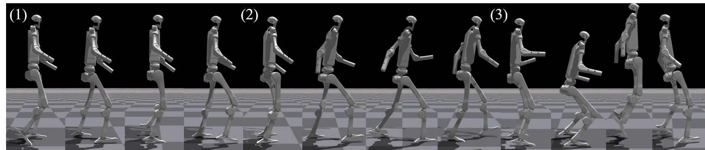
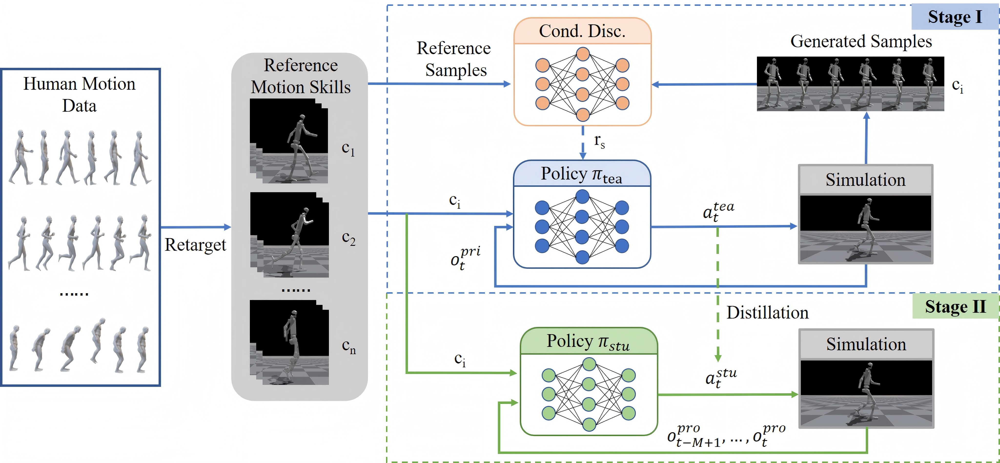
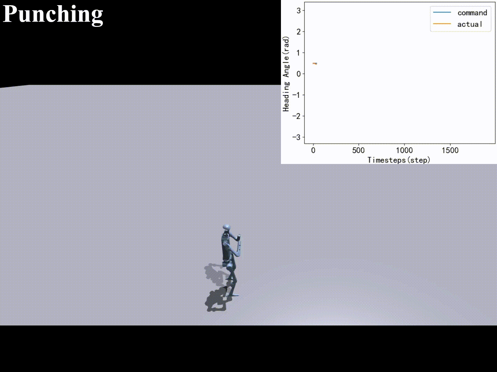
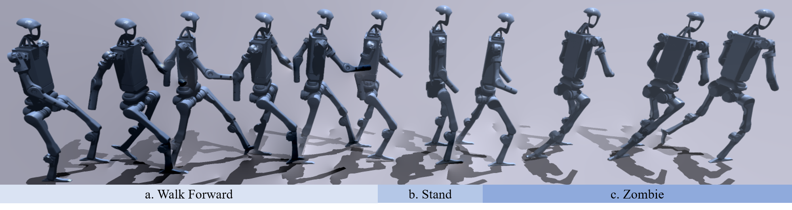
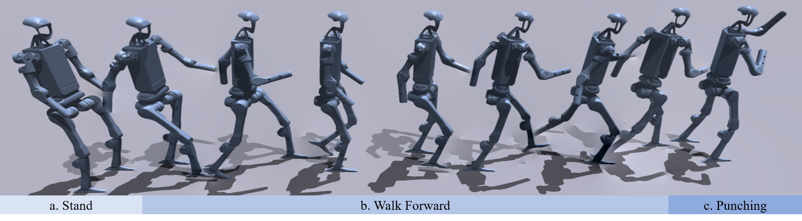
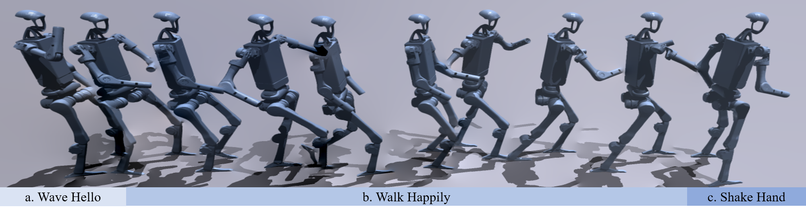

# HAML: Humanoid Adversarial Multi-skill Learning via A Single Policy
HAML aims at learning versatile and anthropomorphic humanoid motion skills via a single policy from reference human motion data.

## Overview

Overview of HAML. During training, the conditional discriminator indirectly regulates the motion state transitions generated by the policy. After the training stage I, a policy network with integrated multiple motion skills is available. This policy is used as teacher policy in the stage II and is trained to obtain a deployable student policy through knowledge distillation.

## Visualization of Heading Control

HAML allows finer motion skill control by incorporating additional task commands during policy training.

## Visualization of Different Tasks
[H-Locomotion](https://www.youtube.com/embed/R9PvCrNR4i8?autoplay=1&vq=hd1080)

[H-Multiwalk](https://www.youtube.com/embed/FYt_6veKqSk?autoplay=1&vq=hd1080)

[Q-Locomotion](https://www.youtube.com/embed/pDW9RemLs1c?autoplay=1&vq=hd1080)

[H-Interaction](https://www.youtube.com/embed/L6fuWg8MHTY?autoplay=1&vq=hd1080)

## Examples of Motion Transition

## Demonstrations on Various Platforms

## Deployment

